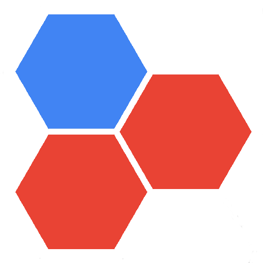

# HEX GAME

<div align="center">
  
</div>

## UNIVERSIDAD PERUANA DE CIENCIAS APLICADAS
<div align="center">
  
</div>

## TRABAJO FINAL

### Curso: 
Complejidad Algorítmica

### Sección:
CC43  

### Profesor:
Carnaval Sánchez, Luis Martin

### Integrantes:
- Aquije Quiroga, Luis Enrique - U202114936
- Ccama Guerra, Rogger Francko Therey - U202416650  
---

## Tabla de Contenido:
1. [Descripción del Problema](#descripción-del-problema)
    - [Descripción](#descripción)
    - [Fundamentación del Problema](#fundamentación-del-problema)
2. [Descripción del Conjunto de Datos](#descripción-del-conjunto-de-datos)
    - [Origen de los Datos](#origen-de-los-datos)
    - [Motivo del Análisis](#motivo-del-análisis)
    - [Relacion con grafos](#relacion-con-grafos)
3. [Propuesta](#propuesta)
4. [Diseño del aplicativo](#diseño-del-aplicativo)
5. [Validación de datos y pruebas](#validación-de-datos-y-pruebas)
6. [Conclusiones](#conclusiones)
7. [Bibliografía](#bibliografía)

## Descripción del Problema
### Descripción
En el mundo de los juegos de estrategia, como el HEX, la teoría de grafos desempeña un papel crucial, brindando herramientas y técnicas para abordar problemas específicos. Uno de estos desafíos se define como la búsqueda de estrategias óptimas basadas en los resultados del ganador del juego, lo cual está estrechamente relacionado con la búsqueda de caminos o conexiones eficientes en el tablero.

En el juego HEX, los jugadores compiten por conectar los lados opuestos del tablero con sus fichas de color. Este objetivo se puede equiparar al concepto de encontrar el camino más corto entre dos puntos en un grafo, donde cada celda del tablero representa un nodo, y las conexiones entre las celdas adyacentes representan las aristas.

En este proyecto, nos enfocaremos en el desarrollo de un bot (jugador rojo) que combine el algoritmo de Dijkstra con un árbol de decisiones. Dijkstra se utilizará para encontrar la ruta más corta entre las fichas del jugador, mientras que el árbol de decisiones permitirá al bot evaluar los diferentes escenarios y tomar decisiones estratégicas en cada turno, basándose en las posibles jugadas y sus consecuencias.

Aunque nuestro enfoque principal no será la implementación completa del algoritmo de Monte Carlo Tree Search (MCTS), tomaremos algunas ideas y conceptos clave de este enfoque. Por ejemplo, utilizaremos simulaciones y rollouts para explorar las posibles jugadas y evaluar su efectividad, lo que contribuirá a mejorar la calidad y efectividad del bot en el juego. Por esa razon esta combinación de técnicas proporcionará al bot la capacidad de analizar el tablero de manera eficiente, simular movimientos potenciales y tomar decisiones estratégicas en cada turno, adaptándose a las jugadas del oponente y buscando la conexión ganadora óptima.

<div align="center">
  
</div>


## Descripción del Conjunto de Datos
En este proyecto, al utilizar el algoritmo de Dijkstra en conjunto con un árbol de decisiones, podemos estimar el número de posibles resultados o nodos en el árbol de decisiones de la siguiente manera:

* Primero, debemos considerar que el tablero de Hex tiene un tamaño de 11x11, lo que significa que hay un total de $121$ celdas o nodos en el grafo.
* Para calcular el número máximo de nodos en el árbol de decisiones, podemos suponer que en cada turno, el bot (jugador rojo) tiene la opción de colocar su ficha en cualquiera de las celdas vacías restantes. Esto significa que en el primer turno, el bot tiene $121$ opciones diferentes.
* En el segundo turno, suponiendo que el oponente (jugador azul) también ha colocado una ficha, el bot tendría $119$ opciones ($121 - 2$ fichas colocadas).
Siguiendo esta lógica, en el turno $t$, el número de opciones disponibles para el bot sería $121 - (2t - 1)$, ya que habrá $(2t - 1)$ fichas colocadas en el tablero ($t$ del bot y $t - 1$ del oponente).

Entonces, el número máximo de nodos en el árbol de decisiones sería la suma de las opciones disponibles en cada turno, desde el turno $1$ hasta el turno $61$ (asumiendo que el juego termina cuando todas las $121$ celdas están ocupadas):

$$Número Máximo Nodos = 121 + 119 + 117 + ... + 3 + 1 = \sum_{t=1}^{61} (121 - 2(t - 1)) = 3721$$ 

Por lo tanto, en el peor de los casos, el árbol de decisiones podría tener un máximo de 3721 nodos.

Sin embargo, es importante tener en cuenta que este cálculo asume que todas las jugadas son posibles y que no se consideran las reglas del juego Hex, que implican la formación de cadenas ininterrumpidas para conectar los lados opuestos.

En la práctica, el número real de nodos en el árbol de decisiones será menor, ya que algunas jugadas serán descartadas por ser inválidas o poco prometedoras. Además, el uso del algoritmo de Dijkstra para encontrar la ruta más corta entre las fichas del bot, junto con la poda del árbol de decisiones basada en heurísticas y evaluaciones, reducirá aún más el tamaño efectivo del árbol de decisiones.

### Origen de los Datos

Los datos se generan durante el transcurso de las partidas de Hex en un tablero de $11$ X $11$, donde se enfrentan dos bots con estrategias distintas:

**Bot Rojo (HardAIPlayer):**

    Utiliza una combinación de algoritmos de búsqueda de caminos (como BFS) de tal forma que, en cada turno, evalúa múltiples rutas posibles y selecciona la que considera óptima. Por esa razon, su objetivo es crear un camino continuo de fichas rojas que conecte los bordes superior e inferior del tablero.


**Bot Azul (GreedyBlueAIPlayer):**

    Emplea una estrategia codiciosa (greedy) enfocada principalmente en bloquear al jugador rojo. Para ello se implemento un sistema de componentes conectados para identificar y obstruir los caminos potenciales del oponente, teniendo en cuenta que mientras bloquea buscará avanzar hacia su propio objetivo de conectar los bordes izquierdo y derecho del tablero.


Los datos se generan y registran de la siguiente manera:

* Movimientos considerados:

  Antes de cada movimiento del Bot Rojo, se guarda en un archivo de texto (movimientos.txt) una lista de todas las posiciones válidas que el algoritmo está considerando.


* Movimiento seleccionado:

  Después de que cada bot realiza su movimiento, se registra la posición exacta donde se colocó la ficha.


* Camino óptimo:

  Para el Bot Rojo, después de cada movimiento, se guarda el camino que el algoritmo considera como el mejor en ese momento, mostrando la secuencia de casillas desde su posición actual hasta el borde objetivo.


* Estado del tablero:

  Después de cada movimiento, se guarda una representación del estado actual del tablero, mostrando las posiciones de todas las fichas rojas y azules.


* Resultado de la partida:

  Al finalizar cada juego, se registra el ganador (Rojo o Azul) y el número total de movimientos realizados durante la partida.


* Estadísticas de nodos explorados:

  Se lleva un conteo de cuántos nodos (posiciones) explora cada bot durante la partida, lo que puede dar una idea de la eficiencia de cada estrategia.

### Motivo del Análisis

El presente estudio se centra en un análisis exhaustivo del rendimiento y las estrategias empleadas por los bots rojo y azul en el juego Hex, con el objetivo de obtener una comprensión profunda de las dinámicas del juego y la efectividad de los algoritmos implementados. En primer lugar, se busca determinar la tasa de victoria (win rate) para ambos bots a lo largo de múltiples partidas. Este análisis no solo proporcionará un porcentaje claro de victorias para cada bot, sino que también permitirá establecer la efectividad general de cada estrategia empleada, ofreciendo insights valiosos sobre qué enfoque resulta más exitoso en el contexto del juego Hex.
Este enfoque se dara con las siguientes areas:

* Tasa de Victoria (Win Rate):

  Determinar el rango de victorias para el bot rojo y el bot azul a lo largo de múltiples partidas para calcular el porcentaje de victorias de cada bot para establecer cuál estrategia es más efectiva en general.

* Exploración de Nodos:

  Cuantificar el número de nodos (posiciones) explorados por cada bot durante las partidas, para comparar la eficiencia de exploración entre el bot rojo (que utiliza algoritmos de búsqueda de caminos) y el bot azul (que emplea una estrategia codiciosa). Además, mapear patrones de movimientos que tienen mayor probabilidad de llevar a la victoria.

* Análisis Probabilístico:

  Desarrollar un modelo probabilístico para predecir las chances de victoria basado en la configuración del tablero en diferentes etapas del juego, que conllevará a calcular la probabilidad de victoria asociada a ciertas posiciones o patrones de fichas en el tablero.


* Evaluación de Estrategias:

  Analizar la efectividad de la estrategia de búsqueda de caminos del bot rojo frente a la estrategia de bloqueo del bot azul, para identificar situaciones donde una estrategia supera consistentemente a la otra. Por ello, se examinará en detalle las partidas donde la victoria se decide por un margen estrecho de tal forma q se dentificará movimientos críticos que pueden cambiar el curso del juego.

<div align="center">
  
</div>

Este análisis exhaustivo proporcionará insights valiosos sobre las dinámicas del juego Hex y las estrategias empleadas por los bots. Los resultados pueden utilizarse para refinar los algoritmos, mejorar las estrategias de juego, y potencialmente desarrollar nuevos enfoques que combinen las fortalezas de ambas estrategias. Además, este estudio podría ofrecer perspectivas interesantes sobre la teoría de juegos y la inteligencia artificial aplicada a juegos de estrategia.
### Relacion con grafos

El juego Hex se presta naturalmente a una representación mediante grafos, lo cual es fundamental para entender y analizar las estrategias de los bots. La relación se puede describir de la siguiente manera:

* Estructura del Grafo:
  
  El tablero de Hex se traduce naturalmente a un grafo donde cada una de las 121 casillas del tablero 11x11 se convierte en un nodo. Las conexiones entre casillas adyacentes se representan como aristas, formando una red compleja. Las casillas internas tienen 6 vecinos, mientras que las de los bordes y esquinas tienen menos, creando una topología única que refleja fielmente la estructura del juego Hex.

* Grafo No Dirigido:
  
  En esta representación, las  conexiones entre casillas son bidireccionales, lo que da lugar a un grafo no dirigido. Esta característica es fundamental para entender cómo los jugadores pueden moverse y conectar sus fichas en cualquier dirección, capturando la esencia de la libertad de movimiento en Hex.

* Grafo Ponderado vs No Ponderado:
  
  En su forma más básica, el grafo del Hex es no ponderado, asignando igual importancia a todas las conexiones. Sin embargo, estrategias más sofisticadas podrían incorporar pesos en las aristas, reflejando la importancia estratégica variable de diferentes conexiones en el tablero, lo que añadiría una capa adicional de complejidad al análisis.

* Subgrafos Dinámicos:
  
  A medida que avanza el juego, se forman subgrafos dinámicos para cada jugador. El subgrafo del jugador rojo busca conectar el borde superior con el inferior, mientras que el del azul intenta unir el izquierdo con el derecho. Estos subgrafos evolucionan con cada movimiento, representando el estado actual del juego y las posibilidades de victoria para cada jugador.

* Componentes Conectados:
  
  El bot azul utiliza el análisis de componentes conectados para identificar y bloquear las estructuras de conexión del oponente. Este enfoque se relaciona con el concepto de componentes fuertemente conectadas en teoría de grafos, permitiendo al bot identificar áreas críticas del tablero donde puede interrumpir las estrategias del oponente. Es por ello que se implemento la estructura DisjointSet, no solo para determinar quien ganó el juego, sino determinar los caminos potenciales que empiezán a crear.

* Optimización de Rutas:
  
  Los algoritmos empleados por los bots pueden interpretarse como problemas de optimización de rutas en grafos. Buscan el camino más eficiente para conectar sus bordes objetivo, considerando no solo la longitud del camino sino también su resistencia a los bloqueos del oponente, lo que añade una dimensión estratégica adicional al análisis del juego. Es por ello que se hizo la implemantacion de recorrido BFS con apertura de fuerza bruta para la evaluacion de los posibles caminos.

<div align="center">
  
</div>


## Propuesta

Para el bot rojo se usará BFS, ya que, BFS usa una búsqueda por anchura con una cierta eficacia en buscar el camino más corto, para este caso lo que se busca es evaluar las posibles rutas y escenarios tratando de buscar el camino mas corto por lo que sería lo más óptimo. En hex todos tienen el mismo peso pero mientras se van eliminando los nodos el peso de estos va cambiando.

Con respecto a los dataset el algoritmo que nos proporcionará muchos más datos será el BFS porque mediante la busqueda por anchura se podrá obtener posibles caminos cortos.


## Diseño del aplicativo

Hemos utilizado la estructura Disjoints o conjuntos disjuntos para realizar y a su vez detectar las uniones de extremo a extremo con las fichas del jugador correspondiente implementando la finalidad del juego, esto mediante nodos auxiliares, dos para el rojo y otros dos para azul. Estos nodos son inicializados en el main. Los extremos están conectados a los nodos auxiliares correspondientes teniendo como complejidad O(1).

También se han empleado funciones de pygame para el dibujo de polígonos y sus contornos como ```pygame.draw.polygon()```, tomando como referencia las coordenadas y el tamaño que tendrá cada hexágono. ```pygame.draw.line()``` para la creación de las líneas que unen los hexágonos. ```pygame.display.flip()``` para mostrar los cambios en la pantalla.

Se diseña el tablero unitariamente cada hexagono con sus respectivas coordenadas como si de un plano cartesiano invertido se tratase tratandolos de manera lógica como si fueran nodos pero representandolos como un tablero de hexágonos.

El uso de una función ```convert_pixel_to_hex_coords()``` es necesaria para poder aplicar DisjointSet ya que este trabaja con coordenadas. Las coordenadas de cada hexágono se emplean para identificar y manipular los nodos en la estructura de datos del Disjoint Set. Esto en el juego Hex es aplicado en forma de hexágonos que vendrían a ser los nodos.

Se agregó también nuevas funciones como ```def get_connected_components(self, color)``` que obtiene los caminos del bot rojo y ```def get_largest_component(self, color)``` obtiene el mas reciente componente que ha creado el algoritmo y determinar el componente más grande. Empleando el algoritmo de Kusaragi analizando los componentes de rojo facilitamos la busqueda de los caminos más cortos.


También se ha utilizado un algoritmo BFS para detectar el camino más corto que se pueda crear y que conecte a los extremos de cada lado del tablero.

La funcion que utiliza este algoritmo es ```_get_shortest_path(self, start, end)``` que recibe como parametros el nodo de inicio y fin el cual luego es almacenado en una cola ```queue``` que sirve para almacenar vértices a visitar y visited que es un conjunto que se utiliza para almacenar los vértices que ya han sido visitados. 

Mediante un bucle ```while``` que ocurre hasta que la cola esté vacía, en cada iteración del bucle se toma un vértice de la cola y se explora. Si el vértice es el vértice final se vuelve el camino hasta dicho vertice, caso contrario se agregan los vertices no visitados de la cola para explorarlos en las iteraciones posteriores

### Analisis de complejidad

```render_hex_map()``` posee una complejidad de tiempo O(n^2) porque tiene dos bucles anidados que recorren ancho y alto del tablero.

```handle_mouse_click()``` posee una complejidad de tiempo O(n) porque llama a una función que tiene un ciclo for que recorre el tablero.

```print_player_positions()``` posee una complejidad de tiempo O(n) porque recorre las posiciones en el tablero.

```run()``` posee una complejidad de tiempo O(n^2) debido a que llama a una funcion ```render_hex_map()``` con una complejidad de tiempo O(n^2)

<<<<<<< HEAD
=======

Algoritmo de Dijkstra adaptado al Árbol de Búsqueda de Monte Carlo (MCTS):
* El algoritmo de Dijkstra tiene una complejidad de tiempo O((V * E) log V), donde V es el número de nodos (vértices) y E es el número de aristas en el grafo. En el caso del juego Hex, con un tablero de 11x11, tendríamos:

    V = 121 (número de celdas en el tablero)
E = aproximadamente 360 (cada celda está conectada a un máximo de 6 celdas adyacentes)

    Por lo tanto, la complejidad de tiempo del algoritmo de Dijkstra en este caso sería O((121 * 360) log 121) = O(481 log 121) ≈ O(481 * 7) = O(3367), que se reduce a O(n log n), donde n representa el tamaño del problema (número de celdas en el tablero).

    La complejidad de dijkstra adaptada a MCTS depende de varios factores, como la profundidad del árbol, el número de simulaciones realizadas y la complejidad de las funciones de evaluación utilizadas.

    Suponiendo que se realizan k simulaciones por cada nodo del árbol, y que la complejidad de la función de evaluación es O(f(n)), donde n es el tamaño del problema (número de celdas en el tablero), la complejidad de tiempo del MCTS sería O(k * b^d * f(n)), donde b es el factor de ramificación (número máximo de jugadas posibles desde un nodo) y d es la profundidad máxima del árbol.
=======
>>>>>>> 606f44fab260d203ccbce9c0d244fd7cbbcffa12
### DisjointSet.py

```__init__()``` posee una complejidad de tiempo O(n) porque inicializa con el tamaño del tablero los diccionarios rank y parent. En este n vendría a ser el número de hexágonos que componen el tablero.

Inicializa la estructura de datos del conjunto disjunto. Crea dos diccionarios, parent y rank, para cada nodo en el tablero. También crea nodos auxiliares para representar los bordes del tablero. 

```find()``` posee una complejidad O(a(n)) porque es constante en todos los valores practicos de n.

Toma un nodo como entrada y devuelve el representante de su conjunto. Utiliza la técnica de compresión de caminos para optimizar futuras búsquedas.

```union()``` posee una complejidad O(a(n)) porque llama a la funcion ```find()``` dos veces

Toma dos nodos como entrada y une sus conjuntos. Utiliza la técnica de unión por rango para mantener el árbol de conjuntos disjuntos equilibrado.

```check_win()``` posee una complejidad O(1) porque solo realiza operaciones constantes

```def get_connected_components(self, color)``` posee una complejidad de tiempo O(n) porque tiene un bucle for que recorre las celdas del tablero

```def get_largest_component(self, color)``` posee una complejidad de tiempo O(n) ya que llama a una funcion ```get_connected_components()``` que posee un bucle for

Verifica si los nodos auxiliares rojos o azules están conectados, lo que indicaría que un jugador ha ganado el juego. Devuelve el color del jugador ganador o None si aún no hay ganador.
<<<<<<< HEAD
=======

### AIhard.py

```__init__(self, game)``` posee una complejidad de tiempo O(n) donde n es el numero de celdas en el tablero

```get_NodesR(self)``` posee una complejidad de tiempo O(1) debido a que solo devuelve el valor de un atributo de la instancia de clase

```_get_valid_moves(self)``` posee una complejidad de tiempo de O(n) donde n es el numero de celdas en el tablero

```print_board(self)``` posee una complejidad de tiempo O(n) debido a que recorre todas las celdas del tablero en un bucle anidado 

```_create_adj_map(self)``` posee una complejidad de tiempo O(n) donde n es el número de celdas en el tablero debido a que recorre las celdas del tablero en un bucle 

```make_move(self)``` tiene una complejidad de tiempo O(n^2) debido a que se llama a la funcion _get_best_move() que a su vez llama a la funcion _get_shortest_path()  la cual tiene una complejidad de tiempo O(n^2) ya que utiliza un algoritmo BFS

```_get_best_move(self)``` posee una complejidad de tiempo O(n^2) debido a que se llama a la funcion _get_shortest_path() que tiene una complejidad de tiempo O(n^2)

```_get_shortest_path(self, start, end``` posee una complejidad de tiempo de O(n^2) donde n es el numeor de celdas en el tablero ya que utiliza un algoritmo de BFS para encontrar el camino más corto entre dos puntos del tablero.

```_update_game_state(self, move)``` tiene una complejidad de tiempo O(1) ya que es de tiempo constante
>>>>>>> 606f44fab260d203ccbce9c0d244fd7cbbcffa12

## Validación de datos y pruebas

## Conclusiones

## Bibliografía

Altamirano, C. (2018). MONTE CARLO TREE SEARCH PARA EL
PROBLEMA DE CARGA DE CONTENEDORES [Informe de proyecto de
título, Pontificia Universidad Católica de Valparaíso]. OPAC. http://opac.pucv.cl/pucv_txt/txt-7500/UCC7969_01.pdf

Algoritmo de Monte Carlo aplicado a Búsquedas en Espacios de Estados. Universidad de Sevilla. https://www.cs.us.es/~fsancho/Blog/posts/MCTS.md

The rules of Hex. Krammer. https://www.krammer.nl/hex/

El algoritmo de Dijkstra. Runestone. https://runestone.academy/ns/books/published/pythoned/Graphs/ElAlgoritmoDeDijkstra.html

"Monte Carlo Tree Search: A New Framework for Game AI" por Michael Buro, de la Universidad de Alberta. https://webdocs.cs.ualberta.ca/~mburo/eps/othereps.php

Amalia Duch. (2006). Esquema de Dividir y Vencer .UPC Universitat Politècnica de Catalunya. https://www.cs.upc.edu/~duch/home/duch/dyd.pdf

Backtracking. Universidad de Illinois en Urbana-Champaign https://jeffe.cs.illinois.edu/teaching/algorithms/book/02-backtracking.pdf

Shirley, A. (s.f.). A* Pathfinding Algorithm Comparison. Recuperado de https://theory.stanford.edu/~amitp/GameProgramming/AStarComparison.html

Rosell, E., & Keila, R. Título del documento (Trabajo de fin de grado). Recuperado de https://diposit.ub.edu/dspace/bitstream/2445/186821/2/tfg_rosell_esau_keila_ruth.pdf

De Waard, H. (2011). Greedy and $K$-Greedy Algorithms for Multidimensional Data Association. IEEE Transactions on Aerospace and Electronic Systems. https://www.academia.edu/101541946/Greedy_and_K_Greedy_Algorithms_for_Multidimensional_Data_Association?sm=b