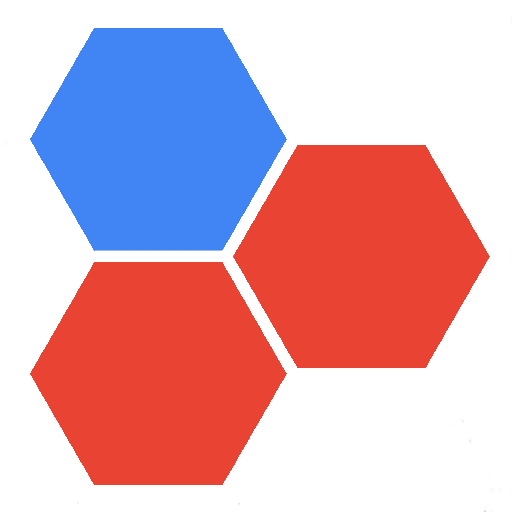

# HEX GAME

  

## UNIVERSIDAD PERUANA DE CIENCIAS APLICADAS

  

## TRABAJO PARCIAL

### Curso: 
Complejidad Algorítmica

### Sección:
CC43  

### Profesor:
Carnaval Sánchez, Luis Martin

### Integrantes:
- Aquije Quiroga, Luis Enrique - U202114936
- Ccama Guerra, Rogger Francko Therey - U202416650  
---

## Tabla de Contenido:
1. [Descripción del Problema](#descripción-del-problema)
    - [Descripción](#descripción)
    - [Fundamentación del Problema](#fundamentación-del-problema)
2. [Descripción del Conjunto de Datos](#descripción-del-conjunto-de-datos)
3. [Propuesta](#propuesta)
4. [Diseño del aplicativo](#diseño-del-aplicativo)
4. [Bibliografía](#bibliografía)

## Descripción del Problema
### Descripción
En el mundo de los juegos de estrategia, como el HEX, la teoría de grafos desempeña un papel crucial, brindando herramientas y técnicas para abordar problemas específicos. Uno de estos desafíos se define como la búsqueda de estrategias óptimas basadas en los resultados del ganador del juego, lo cual está estrechamente relacionado con la búsqueda de caminos o conexiones eficientes en el tablero.

En el juego HEX, los jugadores compiten por conectar los lados opuestos del tablero con sus fichas de color. Este objetivo se puede equiparar al concepto de encontrar el camino más corto entre dos puntos en un grafo, donde cada celda del tablero representa un nodo, y las conexiones entre las celdas adyacentes representan las aristas.

En este proyecto, nos enfocaremos en el desarrollo de un bot (jugador rojo) que combine el algoritmo de Dijkstra con un árbol de decisiones. Dijkstra se utilizará para encontrar la ruta más corta entre las fichas del jugador, mientras que el árbol de decisiones permitirá al bot evaluar los diferentes escenarios y tomar decisiones estratégicas en cada turno, basándose en las posibles jugadas y sus consecuencias.

Aunque nuestro enfoque principal no será la implementación completa del algoritmo de Monte Carlo Tree Search (MCTS), tomaremos algunas ideas y conceptos clave de este enfoque. Por ejemplo, utilizaremos simulaciones y rollouts para explorar las posibles jugadas y evaluar su efectividad, lo que contribuirá a mejorar la calidad y efectividad del bot en el juego. Por esa razon esta combinación de técnicas proporcionará al bot la capacidad de analizar el tablero de manera eficiente, simular movimientos potenciales y tomar decisiones estratégicas en cada turno, adaptándose a las jugadas del oponente y buscando la conexión ganadora óptima.

## Descripción del Conjunto de Datos
En este proyecto, al utilizar el algoritmo de Dijkstra en conjunto con un árbol de decisiones, podemos estimar el número de posibles resultados o nodos en el árbol de decisiones de la siguiente manera:

* Primero, debemos considerar que el tablero de Hex tiene un tamaño de 11x11, lo que significa que hay un total de $121$ celdas o nodos en el grafo.
* Para calcular el número máximo de nodos en el árbol de decisiones, podemos suponer que en cada turno, el bot (jugador rojo) tiene la opción de colocar su ficha en cualquiera de las celdas vacías restantes. Esto significa que en el primer turno, el bot tiene $121$ opciones diferentes.
* En el segundo turno, suponiendo que el oponente (jugador azul) también ha colocado una ficha, el bot tendría $119$ opciones ($121 - 2$ fichas colocadas).
Siguiendo esta lógica, en el turno $t$, el número de opciones disponibles para el bot sería $121 - (2t - 1)$, ya que habrá $(2t - 1)$ fichas colocadas en el tablero ($t$ del bot y $t - 1$ del oponente).

Entonces, el número máximo de nodos en el árbol de decisiones sería la suma de las opciones disponibles en cada turno, desde el turno $1$ hasta el turno $61$ (asumiendo que el juego termina cuando todas las $121$ celdas están ocupadas):

$$Número Máximo Nodos = 121 + 119 + 117 + ... + 3 + 1 = \sum_{t=1}^{61} (121 - 2(t - 1)) = 3721$$ 

Por lo tanto, en el peor de los casos, el árbol de decisiones podría tener un máximo de 3721 nodos.

Sin embargo, es importante tener en cuenta que este cálculo asume que todas las jugadas son posibles y que no se consideran las reglas del juego Hex, que implican la formación de cadenas ininterrumpidas para conectar los lados opuestos.

En la práctica, el número real de nodos en el árbol de decisiones será menor, ya que algunas jugadas serán descartadas por ser inválidas o poco prometedoras. Además, el uso del algoritmo de Dijkstra para encontrar la ruta más corta entre las fichas del bot, junto con la poda del árbol de decisiones basada en heurísticas y evaluaciones, reducirá aún más el tamaño efectivo del árbol de decisiones.
## Propuesta

Se usará DFS en lugar de BFS, ya que, BFS usa una búsqueda por anchura con una cierta eficacia en buscar el camino más corto, algo que a comparación de DFS es mucho más ineficiente, ya que para este caso lo que se busca es evaluar las posibles rutas y escenarios. En hex todos tienen el mismo peso pero mientras se van eliminando los nodos el peso de estos va cambiando.

Con respecto a los dataset el algoritmo que nos proporcionará muchos más datos será el DFS porque mediante fuerza bruta evaluará los 121 posibles caminos del tablero y 3721 posibles nodos.

También se contempla implementar el algoritmo de Dijkstra para encontrar el camino más corto mediante un árbol de decisiones enfocado en Monte Carlo Tree Search el cual hará uso del Backtracking como estrategia de recorrido en profundidad. Este algoritmo reduce su cantidad de posibles nodos que con DFS serían 3721 haciéndolo mucho más eficiente.

A comparación de BFS, Dijkstra es mucho más eficiente, ya que, a pesar de que BFS se enfoca en encontrar el camino más corto, Dijkstra se enfoca en encontrar el camino más corto y además el más eficiente para conectar los lados opuestos del tablero. Por lo que Dijkstra generara menos contenido en el dataset.

Además mediante programación dinámica y algoritmos greedy se realizará la poda de los arboles de decisión para reducir la cantidad de nodos y así hacer más eficiente el algoritmo.

## Diseño del aplicativo

Hemos utilizado la estructura Disjoints o conjuntos disjuntos para realizar y a su vez detectar las uniones de extremo a extremo con las fichas del jugador correspondiente implementando la finalidad del juego.

## Bibliografía

Altamirano, C. (2018). MONTE CARLO TREE SEARCH PARA EL
PROBLEMA DE CARGA DE CONTENEDORES [Informe de proyecto de
título, Pontificia Universidad Católica de Valparaíso]. OPAC. http://opac.pucv.cl/pucv_txt/txt-7500/UCC7969_01.pdf

Algoritmo de Monte Carlo aplicado a Búsquedas en Espacios de Estados. Universidad de Sevilla. https://www.cs.us.es/~fsancho/Blog/posts/MCTS.md

The rules of Hex. Krammer. https://www.krammer.nl/hex/

El algoritmo de Dijkstra. Runestone. https://runestone.academy/ns/books/published/pythoned/Graphs/ElAlgoritmoDeDijkstra.html

"Monte Carlo Tree Search: A New Framework for Game AI" por Michael Buro, de la Universidad de Alberta. https://webdocs.cs.ualberta.ca/~mburo/eps/othereps.php

Amalia Duch. (2006). Esquema de Dividir y Vencer .UPC Universitat Politècnica de Catalunya. https://www.cs.upc.edu/~duch/home/duch/dyd.pdf

Backtracking. Universidad de Illinois en Urbana-Champaign https://jeffe.cs.illinois.edu/teaching/algorithms/book/02-backtracking.pdf

Shirley, A. (s.f.). A* Pathfinding Algorithm Comparison. Recuperado de https://theory.stanford.edu/~amitp/GameProgramming/AStarComparison.html

Rosell, E., & Keila, R. Título del documento (Trabajo de fin de grado). Recuperado de https://diposit.ub.edu/dspace/bitstream/2445/186821/2/tfg_rosell_esau_keila_ruth.pdf

De Waard, H. (2011). Greedy and $K$-Greedy Algorithms for Multidimensional Data Association. IEEE Transactions on Aerospace and Electronic Systems. https://www.academia.edu/101541946/Greedy_and_K_Greedy_Algorithms_for_Multidimensional_Data_Association?sm=b